# Project Management Canvas
## 實際填寫順序（A4 單頁流程圖）

> 📖 **詳細說明：** 如需了解各區塊的詳細填寫指南與實戰範例，請參閱 [[Lean Canvas專案管理模型畫布]]  
> 📝 **空白填空格式：** [點此開啟 A4 列印版空白畫布](assets/html/PM_Canvas_A4.html) - 可直接在網頁上填寫並列印為 A4 橫向尺寸

```mermaid
%%{init: {'theme':'base', 'themeVariables': { 'primaryColor':'#E3F2FD','primaryTextColor':'#1565C0','primaryBorderColor':'#1976D2','lineColor':'#424242','secondaryColor':'#FFF9C4','tertiaryColor':'#FFEBEE'}}}%%
flowchart TD
    %% ============ 起點 ============
    START([🎯 任務接收點])
    
    %% ============ 第 0 層 ============
    PHASE0["<b>第 0 層｜輸入接收</b><br/>📥 老闆丟一句話<br/><small>（先接住，不思考）</small>"]
    
    START --> PHASE0
    
    %% ============ 第 1 循環 ============
    subgraph LOOP1["🔵 第 1 循環｜老闆輸入快照（全部暫定）"]
        direction TB
        L1_1["<b>1 任務背景</b><br/><small>僅記錄事實，不推論動機</small>"]
        L1_3["<b>3 成功定義</b><br/><small>照抄老闆用語，標註待對齊</small>"]
        L1_4["<b>4 執行方案</b><br/><small>只寫形式+數量，不寫規格</small>"]
        L1_8["<b>8 關鍵時程</b><br/><small>死線+第一檢查點</small>"]
        
        L1_1 --> L1_3 --> L1_4 --> L1_8
    end
    
    PHASE0 --> LOOP1
    
    %% ============ 警告 1 ============
    WARN1{{"❌ 禁止事項<br/>第一次填完 1/3/4 就開工"}}
    
    LOOP1 -.->|注意| WARN1
    
    %% ============ 第 2 循環 ============
    subgraph LOOP2["🟡 第 2 循環｜可行性與風險掃描（工程層）"]
        direction TB
        L2_2["<b>2 相關人員</b><br/><small>真正驗收者/卡你的人</small>"]
        L2_7["<b>7 所需資源</b><br/><small>錢/人/權是否足夠</small>"]
        L2_9["<b>9 潛在風險</b><br/><small>最可能爆炸 1-2 點+備案</small>"]
        
        L2_2 --> L2_7 --> L2_9
    end
    
    LOOP1 --> LOOP2
    
    %% ============ 警告 2 ============
    WARN2{{"❌ 禁止事項<br/>沒寫 2/7/9 就鎖死規格"}}
    
    LOOP2 -.->|注意| WARN2
    
    %% ============ 提示框 ============
    NOTE1["💡 <b>到此通常會發現</b><br/><small>原本的 3/4/8 需要修正</small>"]
    
    LOOP2 --> NOTE1
    
    %% ============ 第 3 循環 ============
    subgraph LOOP3["🟠 第 3 循環｜定錨與對齊（正式版）"]
        direction TB
        L3_R1["🔁 <b>回頭修正 1 背景</b><br/><small>修正為真正原因</small>"]
        L3_R3["🔁 <b>回頭修正 3 成功定義</b><br/><small>改為可驗收的一句話</small>"]
        L3_R4["🔁 <b>回頭修正 4 執行方案</b><br/><small>補規格與邊界</small>"]
        L3_R8["🔁 <b>回頭修正 8 關鍵時程</b><br/><small>調整里程碑與檢查點</small>"]
        L3_5["<b>5 溝通回報</b><br/><small>回報頻率、形式、升級條件</small>"]
        
        L3_R1 --> L3_R3 --> L3_R4 --> L3_R8 --> L3_5
    end
    
    NOTE1 --> LOOP3
    
    %% ============ 提示框 2 ============
    NOTE2["✅ <b>此步完成後</b><br/><small>才算正式開工</small>"]
    
    LOOP3 --> NOTE2
    
    %% ============ 第 4 循環 ============
    LOOP4["<b>🟣 第 4 循環｜價值定錨（最後才寫）</b><br/><b>6 預期效益</b><br/><small>對老闆：解決什麼問題<br/>對你：如何被記得、被認帳</small>"]
    
    NOTE2 --> LOOP4
    
    %% ============ 警告 3 ============
    WARN3{{"❌ 禁止事項<br/>6 不可太早寫<br/><small>（易變空話）</small>"}}
    
    LOOP4 -.->|注意| WARN3
    
    %% ============ 第 5 循環 ============
    LOOP5["<b>🔧 第 5 循環｜高手用｜規格反推校正</b><br/><small>參考 1/3/7/6/9 → 回補修正 4 產出</small><br/><br/><small>• 目標變 → 產出跟著變<br/>• 資源不足 → 降規或拆階段<br/>• 風險過高 → 改交付方式<br/>• 效益不明 → 刪非必要產出</small>"]
    
    LOOP4 --> LOOP5
    
    %% ============ 終點 ============
    FINISH(["✅ 完成<br/><b>才正式開工／持續迭代更新</b>"])
    
    LOOP5 ==> FINISH
    
    %% ============ 樣式定義 ============
    classDef startStyle fill:#4CAF50,stroke:#2E7D32,stroke-width:3px,color:#FFFFFF,font-weight:bold
    classDef phaseStyle fill:#E3F2FD,stroke:#1976D2,stroke-width:2px,color:#0D47A1,font-weight:bold
    classDef loop1Style fill:#BBDEFB,stroke:#1976D2,stroke-width:3px,color:#0D47A1
    classDef loop2Style fill:#FFF9C4,stroke:#F9A825,stroke-width:3px,color:#F57F17
    classDef loop3Style fill:#FFE0B2,stroke:#F57C00,stroke-width:3px,color:#E65100
    classDef loop45Style fill:#E1BEE7,stroke:#7B1FA2,stroke-width:3px,color:#4A148C
    classDef warnStyle fill:#FFCDD2,stroke:#C62828,stroke-width:2px,color:#B71C1C,stroke-dasharray:5 5
    classDef noteStyle fill:#C8E6C9,stroke:#388E3C,stroke-width:2px,color:#1B5E20
    classDef finishStyle fill:#A5D6A7,stroke:#388E3C,stroke-width:3px,color:#1B5E20,font-weight:bold
    classDef itemStyle fill:#FFFFFF,stroke:#9E9E9E,stroke-width:1px,color:#424242
    
    class START startStyle
    class PHASE0 phaseStyle
    class LOOP1 loop1Style
    class LOOP2 loop2Style
    class LOOP3 loop3Style
    class LOOP4,LOOP5 loop45Style
    class L1_1,L1_3,L1_4,L1_8,L2_2,L2_7,L2_9,L3_R1,L3_R3,L3_R4,L3_R8,L3_5 itemStyle
    class WARN1,WARN2,WARN3 warnStyle
    class NOTE1,NOTE2 noteStyle
    class FINISH finishStyle
```



### **Z 字型閱讀動線**
1. **第一排**：左→右（起點 → 第0層 → 循環1 → 循環2）
2. **換行**：右上→左下（循環2 → 循環3）
3. **第二排**：左→右（循環3 → 循環4 → 循環5 → 完成）
4. **警告層**：分散在下方，不干擾主流程

---

## 📐 A4 橫向比例優化

### **空間分配**
- **寬度**：7 個主要節點橫向排列
- **高度**：2 排主流程 + 1 排警告
- **比例**：約 16:9 或 4:3，接近 A4 橫向

### **層次結構**
```
層級 1（上層）： 起點 → 輸入 → 快照 → 掃描
層級 2（中層）： 對齊 → 效益 → 反推 → 完成  
層級 3（下層）： 警告提示區
```

## 【第 0 層】輸入接收

**老闆丟一句話 → 先接住，不思考、不執行**

---

## 【第 1 循環】老闆輸入快照（⚠ 全部為暫定）

**目的：承接任務，不承諾、不開工**

**填寫順序：**  
**1 → 3 → 4 → 8**

- **1 任務背景**  
  僅記錄事實（發生什麼），不推論動機
- **3 成功定義**  
  原話照寫老闆語言，標註「待對齊」
- **4 執行方案**  
  只寫形式＋數量，不寫細規
- **8 關鍵時程**  
  老闆死線＋第一個檢查點

---

## 【第 2 循環】可行性與風險掃描（工程層）

**目的：確認做不做得到、會不會出事**

**填寫順序：**  
**2 → 7 → 9**

- **2 相關人員**  
  真正驗收者是誰？誰會卡你？
- **7 所需資源**  
  錢／人／權是否支撐第 1 循環假設
- **9 潛在風險**  
  最可能爆炸的 1–2 點＋備案

> 到此通常會發現：原本的 3／4／8 需要修正

---

## 【第 3 循環】定錨與對齊（正式版）

**目的：把你修正後的理解變成可交差版本**

**回頭修正：**  
**1 → 3 → 4 → 8 → 5**

- **1 背景**：修正為真正原因
- **3 成功定義**：改為可驗收的一句話
- **4 執行方案**：補規格與邊界
- **8 關鍵時程**：調整里程碑與檢查點
- **5 溝通回報**：回報頻率、形式、升級條件

➡️ **此步完成後，才算正式開工**

---

## 【第 4 循環】價值定錨（最後才寫）

**填寫：**  
**6 預期效益**

- 對老闆：解決什麼問題
- 對你：如何被記得、被認帳

---

## 【第 5 循環】高手用｜規格反推校正

**參考：**  
**1／3／7／6／9 → 回補修正 4**

- 目標變 → 產出跟著變
- 資源不足 → 降規或拆階段
- 風險過高 → 改交付方式
- 效益不明 → 刪非必要產出

---

## ⛔ 禁止事項（務必遵守）

- 不可第一次填完 **1／3／4** 就開工
- 未寫 **2／7／9** 前不可鎖死規格
- **6 預期效益** 不可太早寫

---

### 單頁底註

> **先接住 → 再驗證 → 回頭對齊 → 才動手**  
> Project Management Canvas 是風險緩衝器，不是表格。

---

## 🔗 相關文件

- [[Lean Canvas專案管理模型畫布]] - 詳細的填寫指南、九大區塊說明與實戰範例
- [A4 列印版空白畫布](assets/html/PM_Canvas_A4.html) - 可直接在網頁上填寫並列印為 A4 橫向尺寸