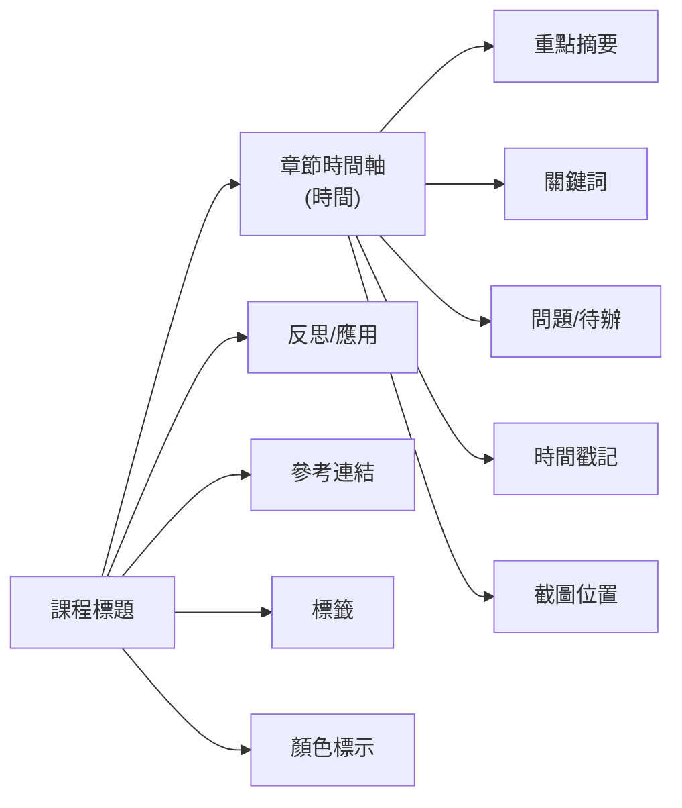

# 前言
這份文件聚焦在「影音與線上課程學習筆記」的版型研究，目的不是單純比較紙張大小，而是釐清不同學習場景下，什麼樣的欄位配置、書寫密度與留白比例，能真正幫助使用者把影片內容轉成可回顧、可行動、可延伸的筆記。研究對象涵蓋 YouTube、Podcast、錄播課程與線上教學平台，因為這些內容雖然都屬於學習素材，但在節奏、資訊量與記錄方式上差異很大，不能用同一種內頁模板直接套用。

本文將 A4、B5、A5 視為三種不同的使用策略，而不只是三個尺寸選項。A4 偏向完整整理與高密度輸出，適合長篇課程、進階筆記與後續複習；B5 是兼顧閱讀舒適與攜帶性的折衷方案，適合學習手冊、講義或系列課程追蹤；A5 則更適合快速記錄、短時段學習與隨身攜帶。後續內容會整理各尺寸的可用版面、常見欄位功能、適合的版型方向，以及紙本與數位輸出時應注意的差異，作為後續模板設計與改版的依據。  

## 紙張尺寸與可用版面比較  

|紙張 | 實際尺寸(mm) | 建議留白邊距（印刷時含出血） | 適用場景（筆記密度／攜帶性／印刷成本）|  
|---|---|---|---|  
|**A4**|210×297|印刷預留 3mm 出血，安全區約5mm；可用版面約190×277 (留約1.5–2cm 邊距)|文字容量最大，可容納約30行中文；適合大量筆記、報告、講義（如公文、報表、教材）。攜帶度最低，印刷成本偏高。|  
|**B5**|176×250|同上；可用版面約156×230 (留1cm邊距)|平衡體積與空間，中文字約20–25行；常見於課本、期刊、學習手冊等閱讀材料。攜帶性居中，印刷成本中等。|  
|**A5**|148×210|同上；可用版面約128×190 (留1cm邊距)|面積最小，中文字約15–20行；適合筆記本、手冊、活動指南等短篇或便攜資料。攜帶度最高，印刷成本最低（用紙量少）。|  

> **註:** 紙張實際可用版面為去除邊距後之空間。留白建議包含印刷出血3mm以及額外安全距離，以避免裁切誤差。

## 影音/線上課程學習關鍵欄位與功能  

在影音或線上課程筆記中，下列欄位與功能可提高效率與組織性：  

- **課程標題**：記錄課程名稱或講座主題，方便整理與檢索；常作為頁面頂端或標題欄位。  
- **章節時間軸**：將影片內容依時間切割，標註章節或重點段落起訖時間（如00:05:30–00:15:20），作為筆記結構。  
- **重點摘要**：對應時間軸段落，簡要寫下主要概念或結論，快速回顧要點。此欄位目的在於提煉影片核心內容。  
- **關鍵詞**：列出重要術語或概念，協助記憶與日後搜尋加速；可置於頁面或段落旁作標籤。  
- **問題/待辦**：記錄聽課過程中產生的疑問或後續任務（例如需補充資料、練習題目），方便課後跟進。  
- **時間戳記**：精確標註對應影片時間點，便於未來回到影片相應位置查看；對於長講座尤為重要。  
- **重點截圖**：預留空間或編號，標明何處要插入影片截圖或板書圖片（可手繪或剪貼），幫助視覺化註記。  
- **反思/應用**：課程結束後寫下個人感想、學習收穫或如何應用所學，以深化理解與實踐。  
- **參考連結**：記錄相關資源網址或文獻資訊，方便後續深入學習；可用縮寫或註腳格式呈現。  
- **標籤**：對筆記分類（如「演算法」、「機器學習」），便於全局管理或搜尋；可用詞語或符號表示。  
- **顏色標示系統**：依課程需求自訂色彩（如紅標定義觀念、藍標問題等），透過顏色區隔訊息類型，提升視覺辨識度。  

上述欄位可根據筆記型式靈活調整。下圖示意課程標題與章節時間軸為主軸，延伸至各功能區的關係結構：  



## 內頁版面範本設計  

下列各版面範本僅為示例，使用者可依實際需求微調版面配置與欄位：

### A4 內頁範本  
1. **時間軸型筆記版面**（Timeline 版）  
   - **版面示意：**  
     ```
     課程標題
     ───────────────────────────
     | 時間   | 重點摘要        | 註記/問題 |
     |-------|----------------|-----------|
     |00:00  | [摘要內容...]   | [Q/Todo]  |
     |05:30  | [摘要內容...]   | [Q/Todo]  |
     |...    | ...            | ...       |
     ```
   - **欄位配置：**時間欄(約20%)、重點摘要欄(60%)、註記/問題欄(20%)。  
   - **字級/行距：**建議正文字體12pt（或10–11pt以放更多文字），標題可稍大如16–18pt；行距約設定為字級的1.5倍。  
   - **留白與分隔線：**可用細線分隔時間列；每格間可留少量空白；頁邊留白建議至少10mm以上。  
   - **使用情境：**適合長度較長的課程錄影或影片，能同步時間點與內容。  
   - **優點：**可快速查找特定時間段的內容，結構清晰。  
   - **缺點：**重點摘要欄較寬敞但空間仍有限，深度筆記可能不夠，可搭配多欄位記錄。  

2. **兩欄重點＋筆記型**（雙欄重點版）  
   - **版面示意：**  
     ```
     課程標題
     ─────────────────────
     | 重點/關鍵詞   | 詳細筆記    |
     |--------------|------------|
     | [Key1]       | [筆記內容]  |
     | [Key2]       | [筆記內容]  |
     | ...          | ...        |
     ```
   - **欄位配置：**左欄（重點或關鍵詞）約30%，右欄（詳細筆記）約70%。  
   - **字級/行距：**正文可使用12pt，標題或重點欄可略大或粗體以便區分；建議行距1.5倍。  
   - **留白與分隔線：**左欄和右欄間可用豎線分隔，兩欄間保留適度內距。上下段落可用橫線或多空行區隔。  
   - **使用情境：**類似康奈爾筆記法，左側簡列問題或要點，右側補充詳細內容；適用需大量關鍵字提示的學習。  
   - **優點：**資訊分類清晰，便於後續複習時只看左欄關鍵詞。  
   - **缺點：**左欄空間有限，若重點過多時會變得擁擠；圖文等豐富內容需切割放。  

3. **問題導向型筆記版**（Q&A 版）  
   - **版面示意：**  
     ```
     課程標題
     ──────────────────────
     | 問題/學習目標     | 筆記內容       |
     |-------------------|---------------|
     | [What / Why?]     | [相關筆記]     |
     | [How / When?]     | [相關筆記]     |
     | ...               | ...           |
     ```
   - **欄位配置：**左欄（問題或目標）約35%，右欄（筆記回答）約65%。  
   - **字級/行距：**正文約11–12pt，問題欄可略大（如13–14pt）以強調；行距可放大至1.5倍以上以增加閱讀流暢度。  
   - **留白與分隔線：**可加入橫線分隔每個Q&A對，或採雙欄無線條形式，用留白區分。  
   - **使用情境：**適合課前列出預期問題、課後檢視理解，或將章節關鍵問答化，強化反思。  
   - **優點：**問題導向能聚焦學習目標，促進主動思考和釐清疑惑。  
   - **缺點：**假設問題需事先設計或課堂中即時歸納，若問題不精確可能影響筆記效益。  

### B5 內頁範本  
（以下範例以B5尺寸內頁設計，格式可參考A4縮放）  
1. **時間軸＋摘要型**：類似A4時間軸型，時間欄與摘要欄劃分較窄，例如時間欄15%、摘要欄70%、註記欄15%。正文建議字級11pt，行距1.5倍。適合中等長度影片，可快速記錄重點。  
2. **二欄重點型**：左列重點（25%）、右筆記（75%），左欄可少寫關鍵字，右欄筆記內容可微縮字級（10–11pt）以增加行數。此版面可容納較多筆記但仍保留結構。  
3. **圖文混合型**：上下分區，上半區為時間軸摘要，下半區留空可貼圖或手繪示意（如公式推導、圖表）。適用需圖示輔助理解的課程。  

### A5 內頁範本  
（以下範例以A5尺寸設計，注重簡潔與重點）  
1. **簡潔列表型**：以大致時間或要點為主的單欄列表，例如「• 00:00 – 課程開場」、「• 05:30 – 主題一重點：…」，字體可用10pt，行距1.5倍。適合快速掃描式筆記。  
2. **兩欄標題＋內文**：上欄寫章節或問題，下欄做筆記摘要。可不畫分隔線，留白分隔段落即可。正文約11pt，行距增大。使用於需要分段記錄的情境。  
3. **思維導圖型**：在A5頁面左側畫簡易思維圖或流程圖，右側留筆記重點欄。由於A5空間有限，此類範本適合線上繪圖或手寫時補充圖示。  

## 字體大小、行距與排版密度比較  

- **字體大小：**中文正文字體通常選用10–12pt為佳。A4因空間較大，可使用12pt，並在標題或重點處加大到15–18pt；B5、A5可將正文字級略降至11pt或10pt，以增加內容密度。  
- **行距：**中文排版宜使用較大行距以提升可讀性，一般建議行距為字級的1.5倍至2倍。大字體（如標題）可用較緊的行距，小字體或密集段落則需加寬行距。  
- **行數與密度：**典型格式中，A4可容納約30行中文（10pt時），B5約20–25行，A5約15–20行。選用雙欄或減小字級可進一步增加行數，但需留意閱讀負擔。  
- **中文排版注意：**避免在欄邊或行尾留下單一字或標點（避免「孤行」）；標點宜采用直排之後置於前行方式（「注音」）；句尾留白可略多於英文字，以符合閱讀習慣。  

## 印刷與數位使用差異及輸出設置  

- **解析度與色彩：**印刷文件建議設為300dpi以上以確保清晰度，色彩模式選CMYK；數位版本（如GoodNotes）則可採RGB，解析度依裝置畫面而定。  
- **出血與裁切標記：**印刷範本需加入出血區（通常3mm）並設置裁切標記；數位版無需出血，可將背景延伸至頁緣（Notability新版網格已會延伸到邊界）。  
- **單面/雙面：**若印刷雙面筆記，需考量釘裝或騎馬訂等裝訂方式，調整鏡像邊距或左右邊留白；同時可設定頁碼於頁腳便於整理。  
- **可填寫欄位互動性：**若輸出為填寫式PDF，可在設計階段預留文本框，並在PDF中建立互動欄位供數位填寫。GoodNotes/Notability等可匯入PDF背景供手寫；兩者對可編輯文本欄位支援有限，宜以靜態欄位為主。  
- **其他建議：**印刷時主頁設計避免使用純文字鏈結，改寫為QR碼或短網址以便紙本掃描；數位筆記可直接嵌入可點擊連結或書籤。  

## 範本格式建議與參考資源  

- **PDF (向量檔)：**優點在於普遍支援、可縮放、不失真，可製作可填寫表單；缺點是一次性編排，非專業軟體難以修改。適用需兼容多裝置閱讀或列印的情境。  
- **PNG (點陣圖)：**易於分享，可作背景圖匯入數位筆記軟體；缺點為不可縮放、文件體積大、印刷品質不穩定。適合純圖或一頁單圖式範本。  
- **InDesign/Illustrator (原始檔)：**專業設計軟體產出，便於精細調整與批量輸出；支援出血、裁切標記等印刷設定。缺點為軟體門檻高、非設計師不易修改。  
- **Canva (雲端可編輯)：**提供豐富模板與直覺化介面，適合自行排版與團隊協作；免費版本功能較基本，輸出可能有解析度限制。多用於製作美觀樣式範本，但需注意最終輸出品質與印刷相容性。  

## 優質範本與參考連結  

1. **Notability官方範本教學** – 包含自訂模板及尺寸設定說明。  
2. **Adobe Acrobat 筆記範本指南** – 提供多種筆記法範本範例與結構說明（Outline, Cornell等）。  
3. **CSIE NTU 字體大小指南** – 台大教授針對中文排版常用字級提出建議（正文字號10–12pt等）。  
4. **印刷出血尺寸教學** – Leatai印刷公司提供完整的出血設定概念與範例。  
5. **紙張尺寸說明** – Printersfy紙張指南系列，可查閱A4/B5/A5等紙張尺寸與常見用途。  

以上內容綜合官方規範與實務建議，以協助設計高效、專業的影音/線上課程學習筆記內頁。各項參考資源提供進一步細節，可依需求深入閱讀。
